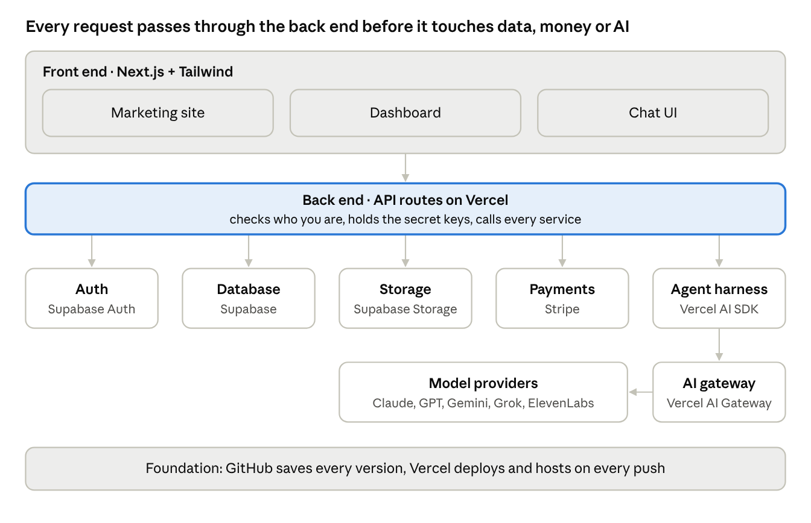

# Module 4 — Web app architecture: the building blocks

Every revenue-generating web app is built from the same 11 building blocks. Pick one tool for each, connect them in the right order, and you have a foundation that scales from 1 user to millions.



The browser only ever talks to the back end; the back end alone holds the keys to the database, Stripe and the AI models.

### Lesson 4.1 — The 11 building blocks

| Block | What it does (plain English) | Analogy | Example tools |
| --- | --- | --- | --- |
| Front end | The public website people see at your domain | The storefront | Next.js, Tailwind CSS, shadcn/ui |
| Dashboard | The logged-in app where members do the work | The back office | Next.js app routes |
| Chat UI | The window where users talk to your AI agent | The help desk | Vercel AI SDK UI, AI Elements, chatbot template |
| Storage | Holds files: images, PDFs, uploads | The filing cabinet | Supabase Storage, Vercel Blob, AWS S3 |
| Database | Organizes information in tables | The spreadsheet | Supabase (Postgres), Neon |
| Auth (OAuth) | Sign-up, sign-in, "Sign in with Google" | The front-door key card | Supabase Auth, Clerk |
| Payments | Charges cards, runs subscriptions | The cash register | Stripe |
| Agent harness | Gives the AI its instructions, tools and memory | The employee handbook + toolbox | Vercel AI SDK, eve, Claude Agent SDK |
| Versioning | Saves every change so you can undo | Save points in a video game | Git + GitHub |
| Deployment | Moves new code from your computer to the internet | The moving truck | Vercel (deploys on every push), Netlify |
| Hosting | The always-on computers that serve your app | The land the building sits on | Vercel, Netlify, AWS, Azure |

**Often added next:** a domain and DNS (GoDaddy, Cloudflare), transactional email (Resend), analytics (Vercel Analytics, PostHog), an AI gateway (Vercel AI Gateway), voice (ElevenLabs, SignalWire).

### Lesson 4.2 — Front end vs back end

The **front end** runs in the user's browser: pages, buttons, forms, the chat window. The **back end** runs on servers you control: it checks who you are, reads and writes the database, calls the AI model with your secret API keys, and talks to Stripe.

**Golden rule:** secrets (API keys, the Stripe secret key, the database service key) live only on the back end, in environment variables — never in front-end code.

### Lesson 4.3 — Following one click through the system

A user clicks **"Ask the tutor"** in the dashboard:

1. The **chat UI** sends the message to your back end.
2. **Auth** confirms the user is signed in and paid up (the **database** says `plan = pro`).
3. The **agent harness** loads instructions, the user's history from the database and any files from **storage**.
4. It calls a model through the **AI gateway**; the model may use **tools** (search, save a note).
5. The answer streams back to the chat UI and is saved to the database.

When you can narrate this path for your own app, you understand its architecture.

### Lesson 4.4 — Foundations that scale

- **Data model first.** Decide your main tables (users, profiles, projects, messages, subscriptions) before building pages. Changing them later is the most expensive fix.
- **Row-level security (RLS).** In Supabase, turn on RLS so each user can only read their own rows — the number-one beginner security gap.
- **Stateless servers.** Keep state in the database and storage, not on the server, so hosting can scale automatically.
- **One source of truth per thing.** Subscriptions live in Stripe and are mirrored to the database by webhooks.

**Prompt to copy:**

```
Act as a senior software architect. For this app: [one-paragraph idea],
map each of these blocks to a specific tool and explain why: front end,
dashboard, chat UI, storage, database, auth, payments, agent harness,
versioning, deployment, hosting. Then list the database tables with
columns, and draw the request flow for the most important user action.
```

**Exercise:** draw your app's architecture on paper or a whiteboard — 11 boxes, arrows for how data flows. Then run the prompt and compare.

**Check yourself:**

1. Where must API keys live, and why?
2. What does row-level security protect against?
3. Trace what happens when a user pays for a subscription.


---

[← Previous](./03-ai-landscape.md) · [Course home](../README.md) · [Next →](./05-the-toolbox.md)
